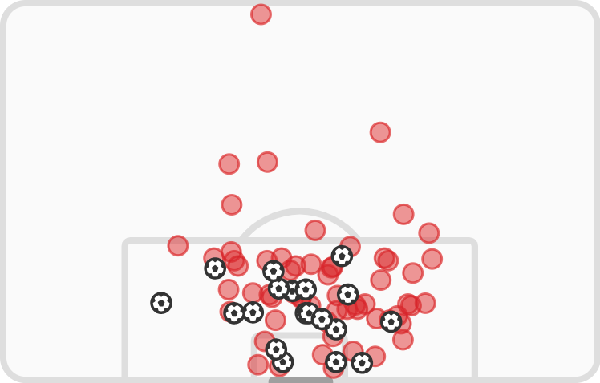
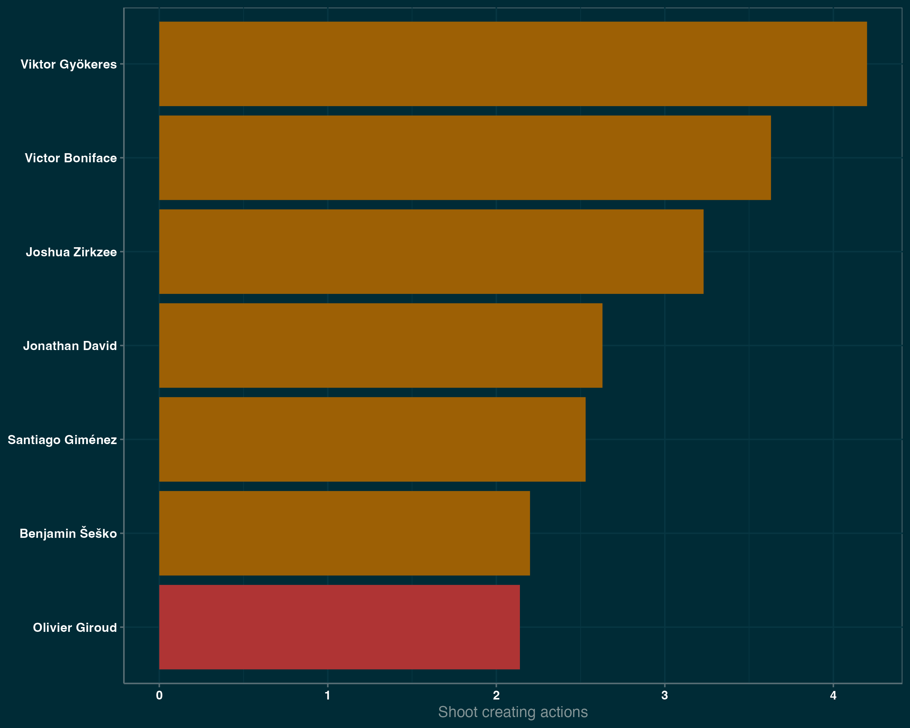
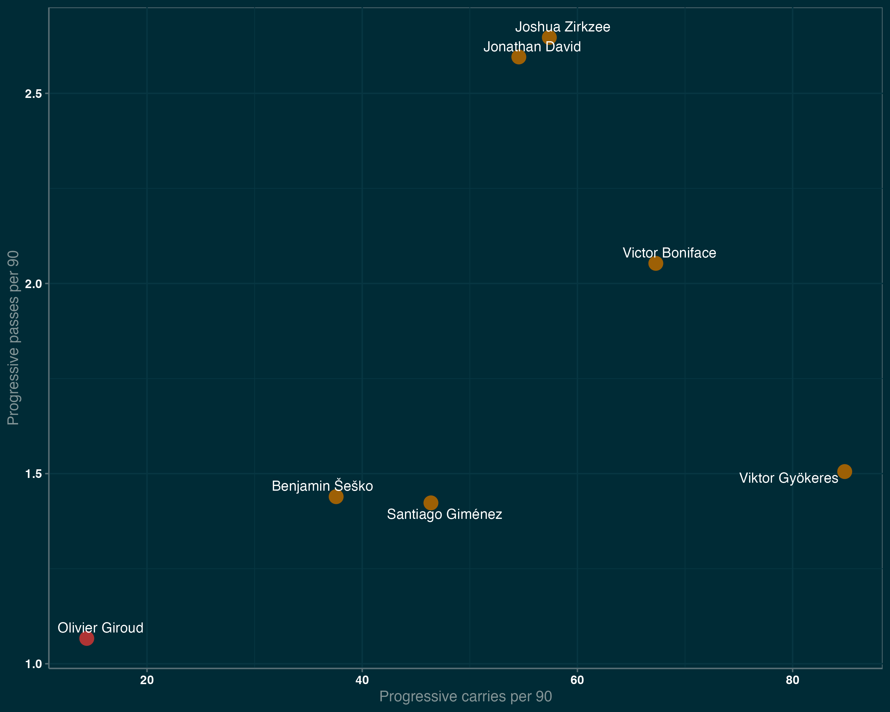
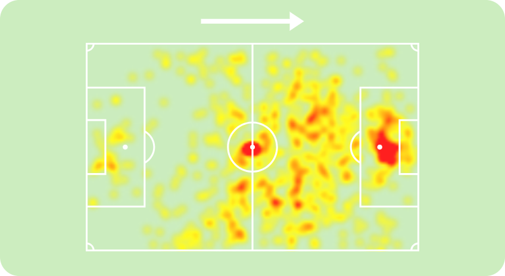
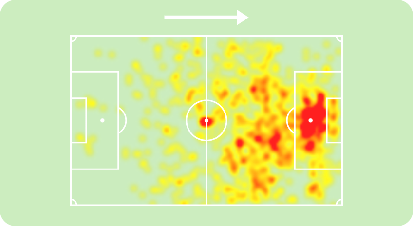
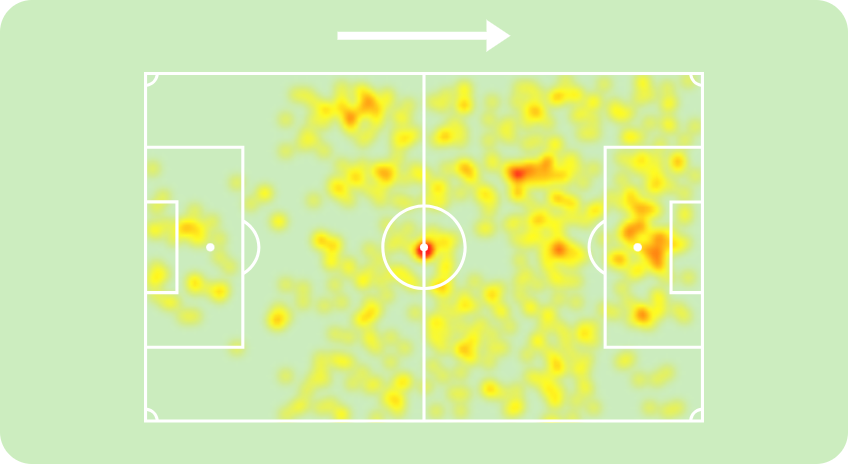

[%hardbreaks]
With Oliver Giroud's departure, Milan must address the long-standing problem with the starting CF this summer.
Rossoneri understands that there will be a need for a significant investment, and the names have circulated in the press for a while. The most discussed candidates are Jonathan David from Lille, Joshua Zirkzee from Bologna, Santiago Giménez from Feyenoord, Benjamin Šeško from RB Leipzig, Victor Boniface from Bayer Leverkusen, and Viktor Gyökeres from Sporting.
Let's analyze these strikers to see who is most suitable for the starting CF role at AC Milan and compare these players with Giroud.

== Goal scoring ability
Of course, scoring goals is the most critical characteristic for a striker. However, the statistics on the goals scored can be misleading, as one season of overperformance can make a mediocre striker look like a top one and vice versa; a season of underperformance can raise doubts about a quality striker's prowess. Therefore, analyzing the amount and quality of the moments that the forward can generate is much better.

The data shows that all these players have more shots per 90 minutes than Giroud, while Joshua Zirkzee is the only player with fewer npxG per 90 minutes, standing at 0.26 npxG per 90, which indicates that he's not the one who can score a lot. Santiago Giménez and Victor Boniface are the outliers, being the most dangerous strikers on the list with 0.73 and 0.76 npxG, respectively.

image::giroud_sm_rp.png[title="Oliver Giroud shotmap. FotMob",374,239]

Looking at the shot map, we can also notice that Zirkzee shoots from the least dangerous position, with an average of 0.9 npxG per shot, and is the only one with worse numbers than the Frenchman. The two most hazardous shooters are David and Giménez, standing at 0.19 npxG per shot.

== Chances created
However, the forward's job is broader than scoring goals; they also create chances for their partners.

The shot-creating actions graph shows that everyone on the list is better than Oliver Giroud at creating chances. While Šeško is slightly ahead of Milan's no. 9, Gyökeres creates almost twice as many chances per 90 minutes of play.

## Build-up
Besides being directly involved in the goals, the attackers can actively be involved in the build-up play. One crucial part of a striker's build-up play is the ability to receive the ball high on the pitch, increasing the probability of a goal.

The data indicates how involved forwards are in receiving the ball higher on the pitch. We can observe that Zirkzee, David, and Šeško are similar to Giroud in these characteristics, with Devid receiving more progressive passes than the others from this group and Šeško having more touches inside the opposition penalty area. However, Gyökeres, Boniface, and Giménez are outstanding in these characteristics, having more touches in the opponent's box and receiving more progressive passes than others.

At the same time, Zirkzee, David, Boniface, and Gyökeres are the players who move the ball higher up the pitch more often than the others via progressive passes and carries.

On the other hand, the strikers might help the team by receiving the ball deeper on the field or the flank, helping the partners in the build-up.

The heatmaps of Giroud, Giménez, Šeško, and Boniface tend to show a similar pattern. All of them primarily touch the ball in the middle of the penalty area, describing them as foxes in the box type of strikers. Yet, all of them occasionally drop deeper to help in the build-up but rarely move to the flanks of the attack.

At the same time, Zirkzee and David tend to receive more balls outside the box and play a more significant role in the team's possession outside the box.

The most exciting heatmap is Viktor Gyökeres's. He seems to be present everywhere, regularly dropping to play the ball and switching to both flanks.

== Chances created
However, the forward's job is broader than scoring goals; they also create chances for their partners.

The shot-creating actions graph shows that everyone on the list is better than Oliver Giroud at creating chances. While Šeško is slightly ahead of Milan's no. 9, Gyökeres creates almost twice as many chances per 90 minutes of play.

## Build-up
Besides being directly involved in the goals, the attackers can actively be involved in the build-up play. One crucial part of a striker's build-up play is the ability to receive the ball high on the pitch, increasing the probability of a goal.

The data indicates how involved forwards are in receiving the ball higher on the pitch. We can observe that Zirkzee, David, and Šeško are similar to Giroud in these characteristics, with Devid receiving more progressive passes than the others from this group and Šeško having more touches inside the opposition penalty area. However, Gyökeres, Boniface, and Giménez are outstanding in these characteristics, having more touches in the opponent's box and receiving more progressive passes than others.

At the same time, Zirkzee, David, Boniface, and Gyökeres are the players who move the ball higher up the pitch more often than the others via progressive passes and carries.

On the other hand, the strikers might help the team by receiving the ball deeper on the field or the flank, helping the partners in the build-up.

The heatmaps of Giroud, Giménez, Šeško, and Boniface tend to show a similar pattern. All of them primarily touch the ball in the middle of the penalty area, describing them as foxes in the box type of strikers. Yet, all of them occasionally drop deeper to help in the build-up but rarely move to the flanks of the attack.

At the same time, Zirkzee and David tend to receive more balls outside the box and play a more significant role in the team's possession outside the box.

The most exciting heatmap is Viktor Gyökeres's. He seems to be present everywhere, regularly dropping to play the ball and switching to both flanks.

== Aerial presence
Aerial dominance is Giroud's most potent ability, hands down, and it was not impacted by age. So, even for the younger attackers, it is tough to outshine his aerial dominance.

image::aerials.png[title="Aerial duels won. Opta, FBref"]

No wonder only a 194 cm tall Benjamin Šeško wins more aerial duels than the Frenchman. At the same time, Jonathan David struggles the most, winning only 0.64 aerial duels per 90.

== Consistency
Being strong one season is good, but consistency throughout multiple seasons can indicate a player's real level. Since all the analyzed players are young, it is natural that not many of them have multiple top-level seasons behind their backs. For Šeško and Boniface, this is their first season in the top-5 leagues. Zirkzee was part of the Bologna squad last season but only played 822 minutes, so this is also his first season as a starter player among the strongest. Despite having incredible stats, Gyökeres and Giménez have yet to play in the top 5 leagues. The only player who has proven his level throughout the year is Lille's forward, Jonathan David. After two great seasons at Gent, he moved to the French site in 2021 and is hitting a double figure of goals, excluding penalties, for the fourth season in a row.
Although it seems a correct decision to buy a player before he has reached his maximum potential, Milan will require a proven goal scorer who will make a difference from the first season.

== Conclusion
After analyzing these players, we see that they all have the potential to become stars and shine in the top clubs. Let's see who is a better match for Milan's new striker.

=== Jonathan David
The Canadian striker has proven his abilities over the years, and he is my personal favorite. He is strong in scoring goals, creating chances, and helping in the build-up. However, he has an apparent weakness in aerial duels, which might be crucial when playing against a low-block team that Milan has struggled against for years.

=== Joshua Zirkzee
Despite being a strong player with great talent, he is not likely to score many goals. His main strength shines outside the penalty area, creating chances for his teammates. This raises doubts about whether it is the right choice to replace Giroud. Rossoneri does not have a shortage of players who can carry the ball and create space and chances for the other; instead, they need someone capable of finishing these chances.

=== Benjamin Šeško
He is the most straightforward Giroud replacement. He is a classical target man with a strong aerial presence, but he is much younger, thus more mobile and faster than the French striker. However, there are questions about whether he's ready to be a starter for a top Italian club since he's far from being a regular starter at RB Leipzig, starting only 13 matches in 29 matchdays in the Bundesliga this season.

=== Victor Boniface
He's a jack of all trades, thriving in every aspect of the game. He's a constant threat to the goal, present in the build-up, great at progressing the ball, and creates chances for others.

=== Viktor Gyökeres
One of the most discussed strikers in the market, with an incredible 27 goals and 12 assists this season so far. Although these numbers come from an overperformance season, he's still a constant threat to the opposition's goal and, based on the data, the most versatile striker on the list.

=== Santiago Giménez
Second most dangerous striker on the list, after Viktor Boniface. Although he's less involved in the build-up play, his presence in the box constantly threatens the opponents. It's worth saying that he is playing in the weakest league, making him the riskiest option to replace Olivie Giroud. On the other hand, if the risk pays off, Rossoneri will finally have a top-level striker who can make a difference.
