[%hardbreaks]
Проблема центрального нападника є найгострішою в "Мілані" вже давно. Влітку Олівʼє Жиру покине "Мілан" та відправиться догравати в МЛС, і це означає, що надалі відкладати вирішення цієї проблеми не можна.

Россонері розуміють, що доведеться викласти значну суму за центрального нападника, і вже приглядаються до можливих кандидатів. Найбільш вірогідними кандатами на заміну досвідченого француза є Джонатан Девід з "Лілля", Джошуа Зіркзі з "Болоньї", Сантьяго Хіменес з "Феєнорда", Беньямін Шешко з "РБ Лейпциг", Віктор Боніфейс з "Баєра" та Віктор Дьокереш зі "Спортинга".

Проаналізуємо цих кандидатів та розглянемо, хто ж з них дійсно підсилить "Мілан" та зможе замінити Жиру, який є найкращим бомбардиром та найкращим асистентом своєї команди в Серії А.

== Голи
Звичайно, що найбільш важливим фактором для нападника є голи. Однак саме статистика голів може давати хибну оцінку гравця. Один сезон оверперформансу може змусити "Салернітану" здійснити найдорожчий трансфер в своїй історії, або ж пів сезону оверперформансу може змусити "Мілан" заплатити 35 млн в січні. Однак гравці, які здатні стабільно кожного сезону забивати значно більше ніж створених моментів, одиниці. Тому значно надійніше дивитись на кількість моментів, які має гравець, або в термінології статистики — Non-penalty Expected Goals (npxG).

image::npxG.png[title="npxG and shots per 90. Opta, FBref"]

Графік показує, що майже всі гравці мають більше моментів, ніж Жиру. Лише Зіркзі поступається Жиру в цьому компоненті, маючи моменти трохи більше ніж на 1 гол кожні 4 матчі, та не виглядає як нападник, який зможе багато забивати. Найбільше ж моментів мають Хіменес та Боніфейс, які генерують більше ніж 0,75 npxG за 90 хв на полі.

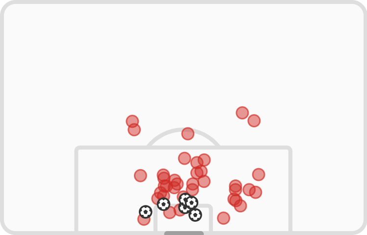
image::david_sm_rp.png[title="Jonathan David shotmap. FotMob",374,239]
image::zirkzee_sm_rp.png[title="Joshua Zirkzee shotmap. FotMob",374,239]
image::sesko_sm_rp.png[title="Benjamin Šeško shotmap. FotMob",374,239]
image::gyokeres_sm_rp.png[title="Viktor Gyökeres shotmap. FotMob",374,239]
image::boniface_sm_rp.png[title="Victor Boniface shotmap. FotMob",374,239]
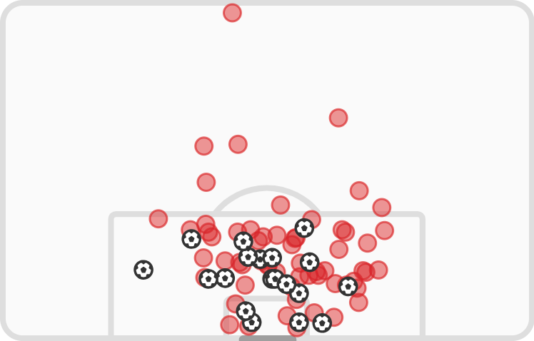

Також всі гравці частіше, ніж Жиру, наносять удари по воротах. Але і тут Зіркзі поступається всім "конкурентам", так як його удари приходяться з найменш небезпечних позицій (0.09 npxG/Sh), в той час як найбільш небезпечні удари в Девіда (0.20 npxG/Sh) та Хіменеса (0.19 npxG/Sh).

== Створені моменти
Але нападники не лише забивають голи, а і допомгають забивати іншим, створюючи моменти для ударів своїм партнерам.

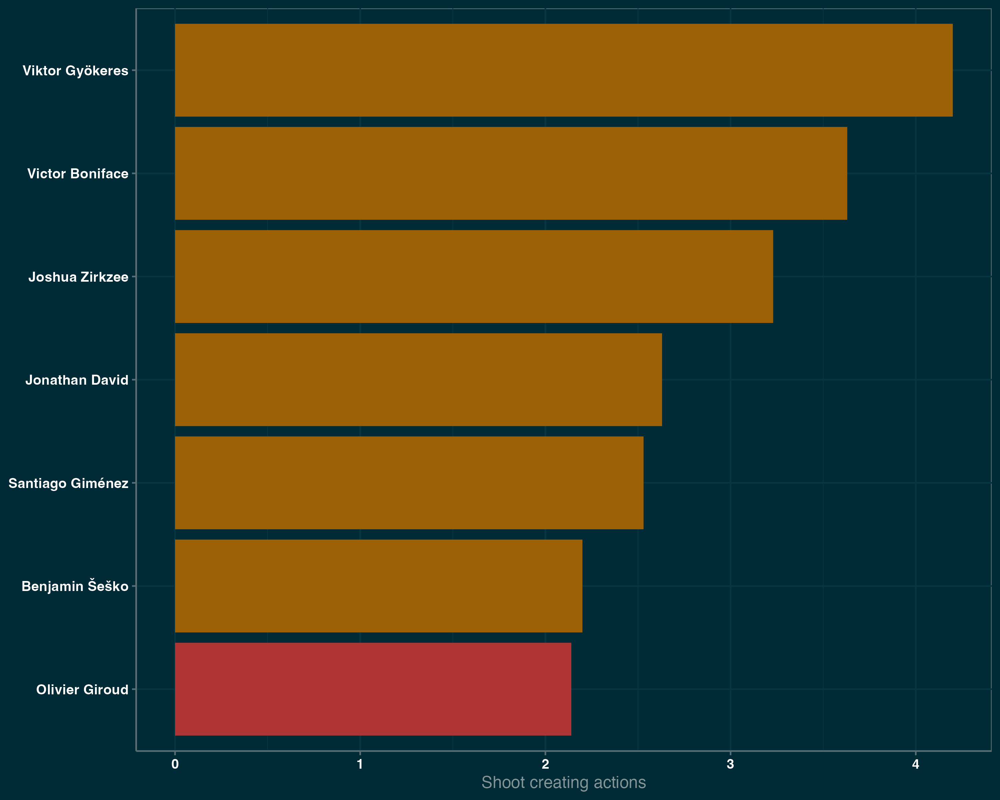

Графік дій, що призводить до удару показує що кожен з цих нападників створіє більше можливостей для удару по воротах ніж Олівʼє Жиру. В той час як Шешко лише трохи випереджає французького нападника, Дьокереш створює майже в два рази моментів для удару за матч.

== Позиційна гра
Крім дій, що напряму призводять до взяття воріт суперника, нападники можуть активно бути залучені в позиційній грі команди. Одним з важливих компонентів для багатьох нападників є вміння приймати мʼяч біля чужих воріт, що дозволяє команді переносити володіння в небезпечну зону, з чого в подальшому і створюються моменти та голи.

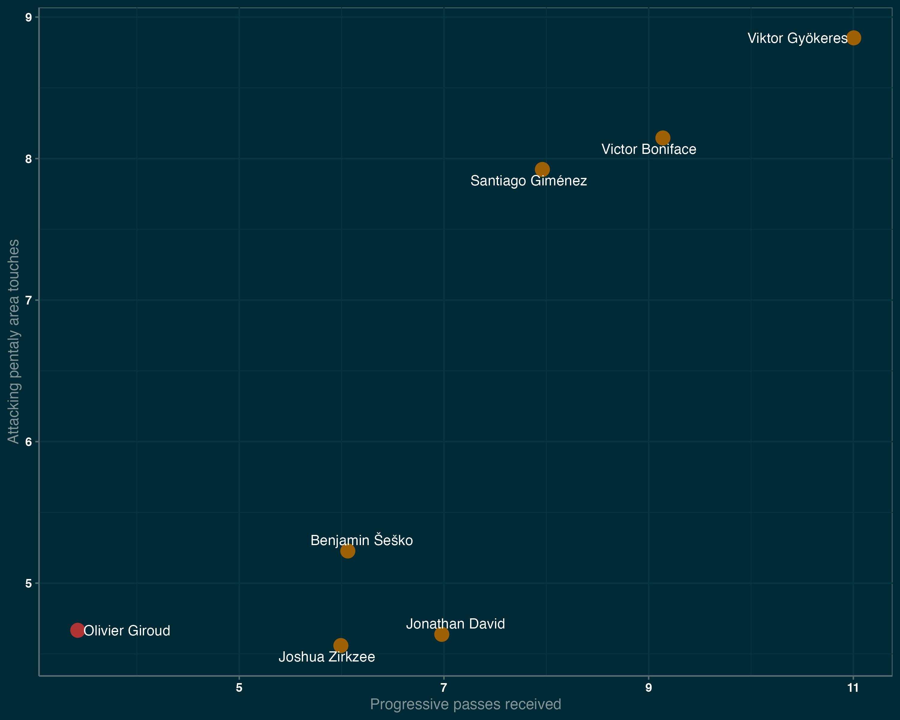

Найбільше в цьому аспекті виділяється Віктор Дьокереш, який лідирує за отриманими прогресивними пасами та за кількістю доторків в чужому штрафному. Трохи відстають від нього Віктор Боніфейс та Сантьяго Хіменес. Тим не менш, всі наявні кандидати випереджають по цим показникам Олівʼє Жиру, який з віком очікувано стає менше залученим в гру команди.

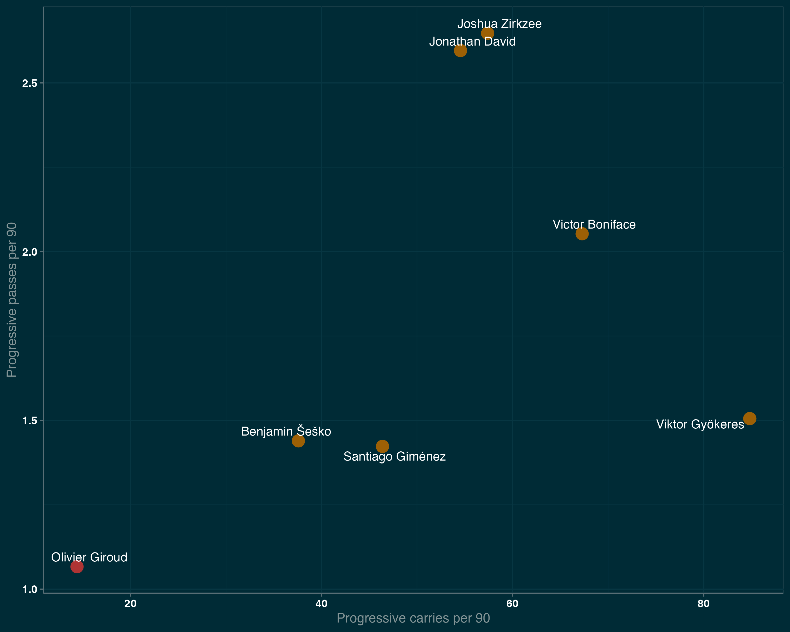

В той самий час, Зіркзі, Девід, Боніфейс та Дьокереш найбільше за інших просувають мʼяч ближче до чужих воріт, завдяки пасам та просування з мʼячем.

Але від нападників переважно потребують більшого, ніж бути лише стовпом, тому нападники часто опускаються нижче, зміщуються на фланг та міняються позицією з партнерами, створюючи більшість та дозволяючи розігрувати мʼяч в критично важливих ділянках поля.

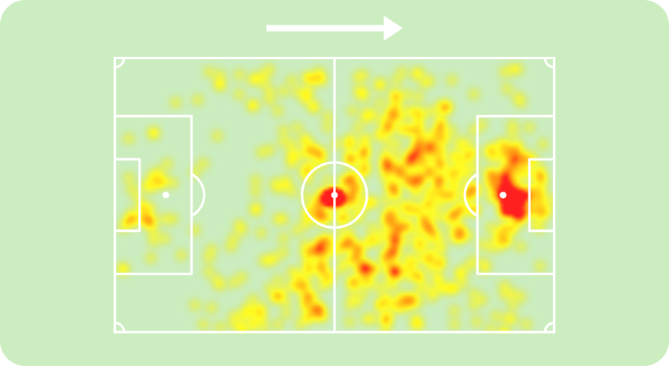
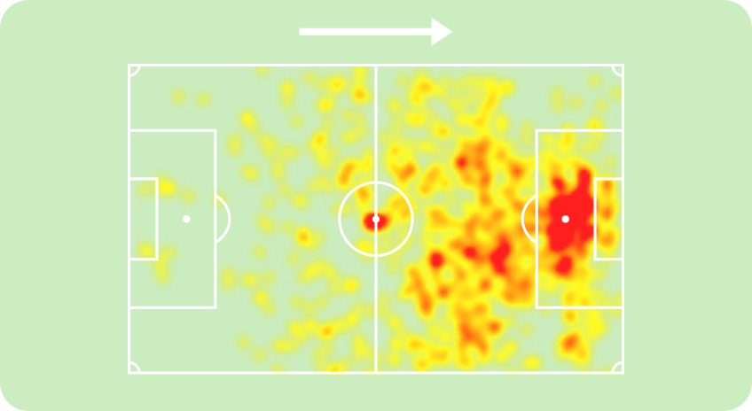
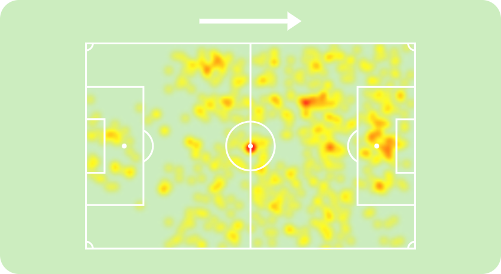
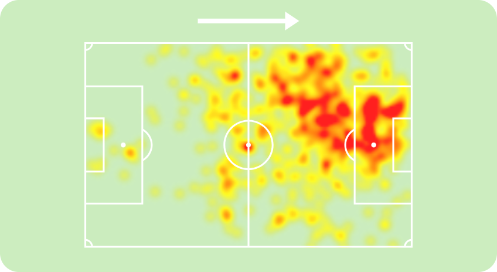

Теплова мапа Жиру, Хіменеса, Шешко та Боніфейса показує схожі зони дій цих чотирьох нападників. Всі вони здебільшого діють в центрі штрафного майданчику, епізодично опускаючись нижче для прийому та розіграшу мʼяча, але майже не зміщуються на фланги.

image::david_hm.png[title="Jonathan David heatmap. SofaScore",374,239]
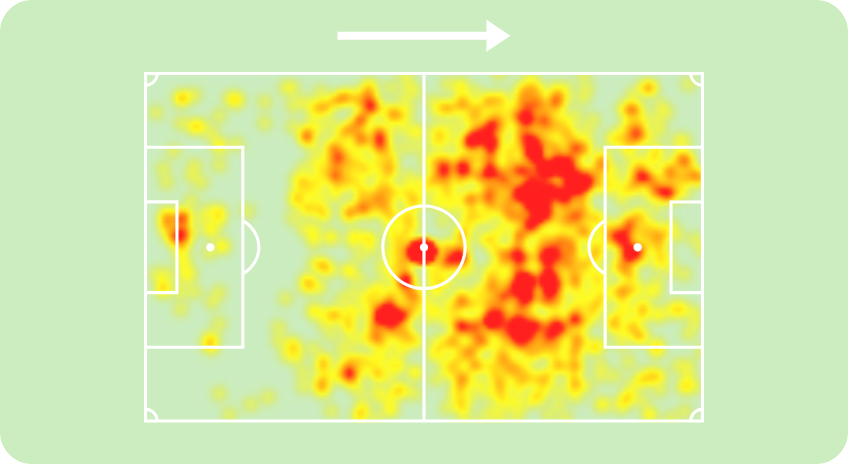

Джошуа Зіркзі та Джонатан Девід частіше ж діють з мʼячем перед штрафним майданчиком, полюбляючи опускатись нижче для розіграшу мʼяча.

image::gyokeres_hm.png[title="Viktor Gyökeres heatmap. SofaScore",374,239]

Найцікавіше в цьому аспекті виглядає теплова мапа Віктора Дьокереша, який діє по всьому фронту атаки, не тільки опускаючись нижче для розіграшу мʼяча, але й регулярно зміщуючись на фланг.

== Верхова боротьба
Важливу роль в грі нападників є вміння вигравати верхові єдиноборства.

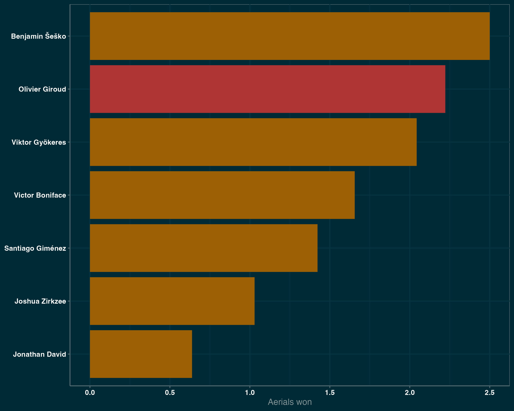

І єдиним гравцем, кращим за Жиру, в цьому компоненті, є Шешко. В той час, як Девід, суттєво поступається всім в цьому компоненті, що і не дивно, враховуючи, що він є найнижчим гравцем зі списку.

== Стабільність
Хоч один сезон і є достанім відрізком для оцінки гравця, набагато краще для розуміння реального рівня гравця є відрізок у декілька сезонів. І хоч це і є та категорія, де Жиру впевнено лідирує, але в його рівні сумніватись ніколи не доводилось, тому не буде його враховувати.

Більшість гравців з цього списку є досить молодими та проводять чи не перший свій сезон на дорослому рівні. Для Шешко Зіркзі та Боніфейса це перші повноцінні сезони в чемпіонаті рівня топ-5. Для Дьокереша це перший повноцінний сезон у вищому дивізіоні взагалі, так як раніше він грав у Чемпіоншипі, хоч і грав там дуже успішно. Хіменес же проводить свій другий повноцінний та успішний сезон в нідерланській Ередевізі. Найбільше ж з-поміж усіх виділяються канадський форвард Девід, який вже 4-ий сезон поспіль є головним бомбардиром "Лілля", а до цього так само багато забивав за "Ґент".

І хоч купувати гравця до того, як він повністю розкрився і виглядає найкращим моментом для трансфера, це також є більш ризикованим варіантом, так як гравцеві може знадобитись більше часу для адаптації та він гірше може сприймати стрес після переходу на новий рівень.

== Висновки
Загалом кожен з цих нападників є гравцем великого таланту та всі вони скоріше за все будуть мати чудову ігрову карʼєру. Але давайте розглянемо кожного окремо на роль основного нападника "Мілана" на наступний сезон.

=== Джонатан Девід
Мій особистий фаворит. Довів своє вміння багато забивати протягом багатьох сезонів, рухливий та небезпечний в чужому штрафному майданчику. Але його основним мінусом є гра на другому поверсі. Для "Мілана", якому часто доводиться грати проти низького блоку, це може бути суттєвим недоліком.

=== Віктор Дьокереш
Найбільш "розкручене" їмʼя з усіх завдяки великій кількості забитих голів цього сезону. І хоч ці голи пояснються аномальним оверперформансом, він все одно має багато моментів. Найцікавіше ж в ньому те, що крім цього, він також допомагає створювати багато моментів партнерам своєї рухливістю та сміливим діям на полі.

=== Віктор Боніфейс
Так само як і Дьокереш, він є універсальним гравцем який вміє робити все що може бути необхідне від нападника. Генерує багато моментів для себе та для партнерів, вміє просувати мʼяч вперед та обігруватись з партнерами. Такий гравець, безсумнівно, може стати форвардом світового класу

=== Сантьяго Хіменес
Найбільш небезпечний гравець з усього списку, який постійно загрожує воротам суперника. Та хоч він і небагато задіяний в комбінаційній грі команди, немає сумніву в тому, що забивати він буде багато.

=== Беньяамін Шешко
Якщо хтось і є найочевиднішою заміною Жиру, то це Шешко. Класичний стовп, який несе найбільшу загрозу в штрафній суперника. Хоча і своєю фізикою також може створювати простір для швидких партнерів. Основним його мінусом все ж є відсутність досвіду. Та навіть у "РБ Лейпциг" він не є безальтернативно основним гравцем комади.

=== Джошуа Зіркзі
Не виникає жодних сумнівів, що нідерладець є гравцем високого рівня, який підсилить будь-яку команду. Однак чи саме такий гравець потрібен Мілану на роль основного нападника? На мою думку ні. Джошуа в першу чергу створює моменти іншим та грає за межами штрафного майданчику. Те саме в "Мілані" роблять Леао, Пулісік, Лофтус-Чік та інші. В той час "Мілану" потрібен гравець, який буде нести безпосередню загрозу в штафному майданчику, бо саме звідти забивають більшість голів. Єдина реальна причина чому Мілану може бути потрібен Зіркзі, це якщо на роль головного тренера прийде Мотта, який має чіткий план як його використовувати. Але навіть з Моттою, чи не було б краще купити більш класичного нападника, який підійде будь-якому тренеру?
